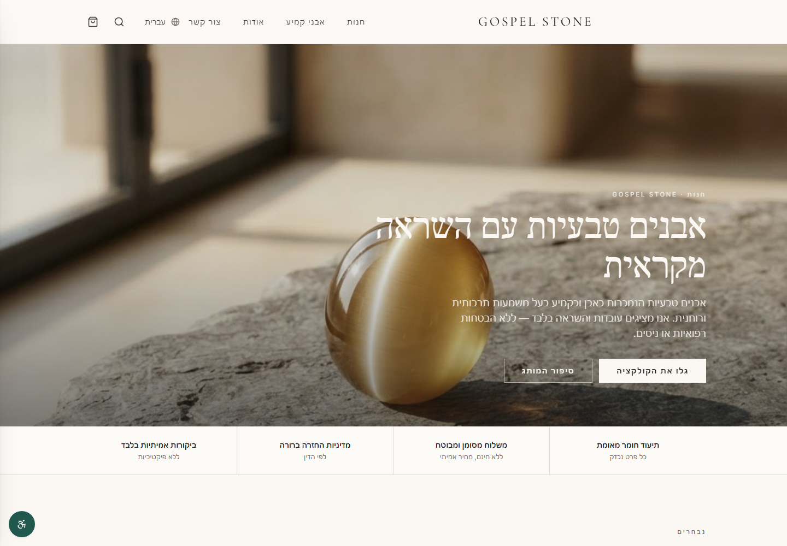
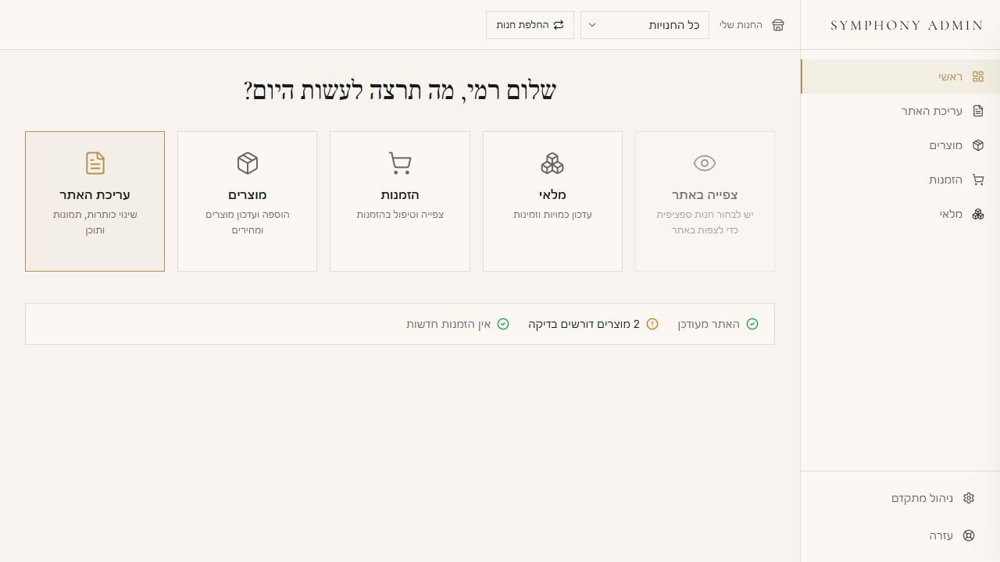

# Product & Web Portfolio — Drbenji55

A concise portfolio case study for **Luxury Trio Collective**, a multi-brand commerce platform built in Base44.

## Luxury Trio Collective

Three customer-facing brands share one protected administration system:

- [Gospel Stone](https://gospelstone.com/) — natural stones
- [Gospel Jewels](https://gospeljewels.com/) — fine jewelry
- [Holy Land Gospel Art](https://hlgospelart.com/) — faith-inspired art

### My contribution

- Product strategy and information architecture
- UX/UI design for storefronts and the shared Symphony Admin
- Store-scoped data and permission design
- Structured visual content editor and guided product workflow
- Hebrew RTL plus English, Spanish and German LTR foundations
- Responsive and accessibility-focused implementation
- Sandbox-first payment architecture and server-side order validation

### The core design problem

The customer experience needed to feel like three independent brands. The owner experience needed to feel like one simple system. The result combines strict storefront isolation with a shared administration interface organized around recognizable business tasks.

## View the full case study

Open the published portfolio at **[drbenji55.github.io](https://drbenji55.github.io/)**.

---

Public storefront images and interface screenshots are included for portfolio presentation. Credentials, customer data, internal identifiers and private administration data are intentionally excluded.
