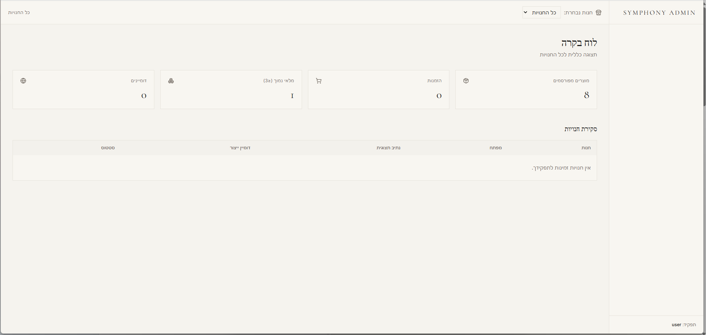
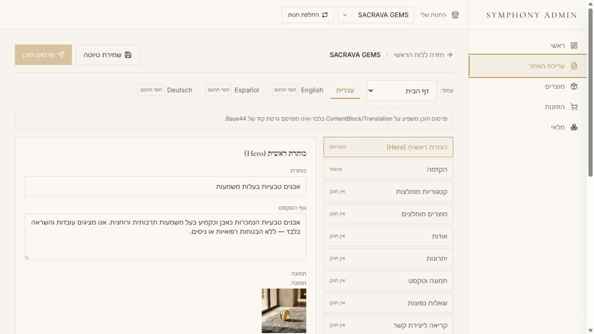
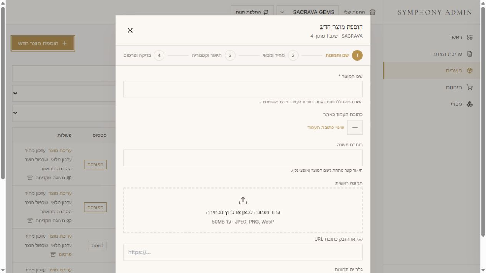
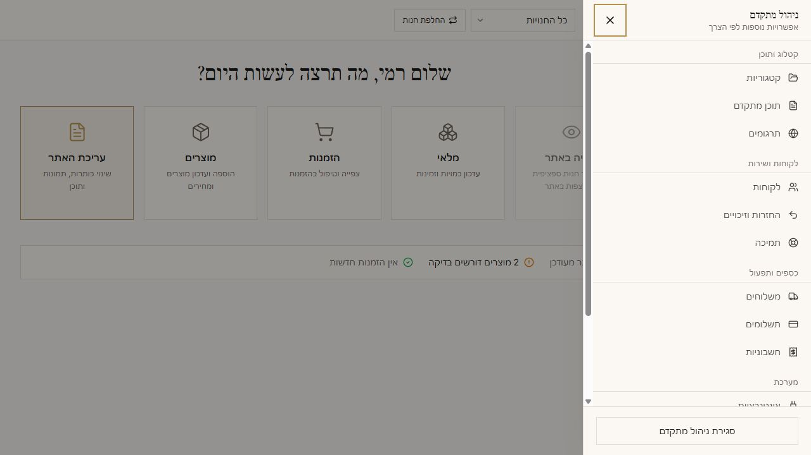

# Drbenji55 — Product & UX Portfolio

I design and build clear, secure web products that turn complex business operations into simple customer and owner experiences.

**Product strategy · UX/UI design · Information architecture · Accessibility · AI-assisted web implementation**

## Selected case study — Luxury Trio Collective

One multi-brand commerce platform with three independent customer experiences and one protected administration system.

| Public brand | Experience | Live site |
| --- | --- | --- |
| Gospel Stone | Natural stones | [gospelstone.com](https://gospelstone.com/) |
| Gospel Jewels | Fine jewelry | [gospeljewels.com](https://gospeljewels.com/) |
| Holy Land Gospel Art | Faith-inspired art | [hlgospelart.com](https://hlgospelart.com/) |

### The product challenge

The public experience needed to feel like three complete and unrelated brands. The owner experience needed to feel like one calm system. The solution balances brand freedom with strict storefront isolation, store-scoped data and a shared task-first administration interface.

### My contribution

- Framed the multi-brand product and information architecture
- Designed three distinct storefront experiences on one reusable foundation
- Reshaped the central admin around five recognizable everyday jobs
- Designed a structured visual content editor and four-step product wizard
- Preserved store-scoped permissions and protected administration access
- Built Hebrew RTL plus English, Spanish and German LTR foundations
- Treated 360px responsive behavior and accessible interaction as requirements
- Kept payment behavior honest and sandbox-first during the client-preview stage

### Scope

| Measure | Result |
| --- | --- |
| Storefronts | 3 isolated public brands |
| Administration | 1 shared protected system |
| Admin work areas | 17 organized destinations |
| Language foundations | Hebrew, English, Spanish and German |
| Responsive baseline | 360px and above |
| Commerce status | Sandbox — no production payment claim |

### From technical-first to task-first

The administration experience was reorganized around what the owner wants to accomplish: edit the site, manage products, review orders, update inventory and open the storefront. Advanced tools remain available through progressive disclosure.

| Earlier state | Redesigned Symphony Admin |
| --- | --- |
|  |  |

### Interface system

| Visual content editor | Product wizard | Advanced management |
| --- | --- | --- |
|  |  |  |

### Architecture principles

1. **Store scope is explicit.** Products, orders and admin views remain associated with the correct storefront.
2. **Public brands stay separated.** Navigation does not expose cross-brand links.
3. **Administration is protected.** Public routes do not expose management data.
4. **Commerce is server-first.** Browser-supplied values are not trusted for price or store assignment.
5. **Complexity is progressively disclosed.** Everyday tasks remain clear while advanced capabilities stay accessible.
6. **Status is honest.** Sandbox commerce is never presented as production readiness.

## View the portfolio

The complete visual case study is published at **[drbenji55.github.io](https://drbenji55.github.io/)**.

---

Public storefront images and interface screenshots are included for portfolio presentation. Credentials, customer data, private records, internal identifiers and protected administration data are intentionally excluded. The original Base44 application is not stored in this repository.
